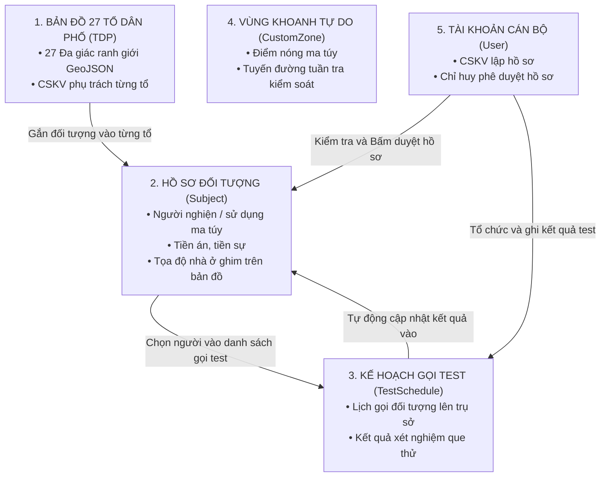
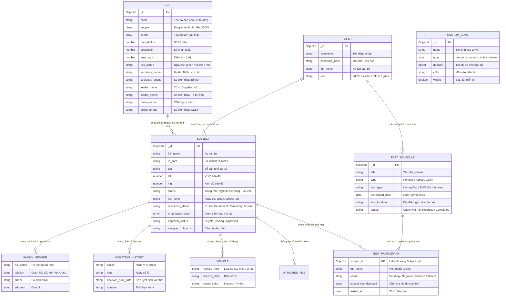

# TÀI LIỆU ĐẶC TẢ CƠ SỞ DỮ LIỆU (DATABASE SPECIFICATION)
## Bản đồ số & Quản lý đối tượng ma túy - Phường Liên Chiểu

> [!IMPORTANT]
> **CẬP NHẬT ĐỊA BÀN & TINH GỌN DỮ LIỆU:**
> 1. **Địa bàn:** Đã chuẩn hóa còn đúng **27 Tổ dân phố mới** (không còn 78 tổ cũ trước sáp nhập).
> 2. **Hệ thống dữ liệu:** Đã loại bỏ hoàn toàn 2 phân hệ **PCCC** (`pcccrecords`) và **Cơ sở kinh doanh** (`businesses`) để tập trung vào nghiệp vụ quản lý người nghiện/sử dụng ma túy và bản đồ số địa bàn.

---

## PHẦN 1: GIẢI THÍCH NGHIỆP VỤ (DÀNH CHO NGƯỜI MỚI)

Hệ thống hoạt động tương tự như một **Tủ hồ sơ điện tử** của Công an phường, gồm 4 ngăn chính:

### Mối liên hệ thực tế giữa các thông tin:
1. **Con người gắn với 27 Tổ dân phố:** Mỗi đối tượng quản lý thuộc về 1 trong 27 Tổ dân phố mới (như Quang Thành 1-9, Đa Phước 1-4, Thanh Vinh 1-3, Quan Nam 1-5...). Khi bấm vào một tổ trên bản đồ số, hệ thống gom toàn bộ đối tượng thuộc tổ đó hiển thị ra màn hình.
2. **Một bộ hồ sơ kẹp đủ giấy tờ liên quan:** Mở hồ sơ của một đối tượng là thấy đầy đủ:
   - Danh sách thân nhân trong gia đình (`family_members`).
   - Lịch sử tiền án, tiền sự, các lần bị xử phạt (`violation_histories`).
   - Phương tiện xe máy, ô tô hay đi lại (`registered_vehicles`).
   - Tình trạng cai nghiện và loại ma túy hay sử dụng (`drug_types_used`).
3. **Kế hoạch gọi test ma túy:** Hàng tháng lập đợt kiểm tra, chọn các đối tượng từ danh sách quản lý. Sau khi thử que, kết quả (Âm tính / Dương tính / Vắng mặt) tự động nhảy vào mục "Kết quả test gần nhất" trên hồ sơ cá nhân của người đó.
4. **Phê duyệt 2 cấp:** Cán bộ nhập liệu thì hồ sơ ở trạng thái `Pending` (Chờ duyệt). Chỉ huy kiểm tra xong bấm `Approved` (Đã duyệt) thì đối tượng mới chính thức hiển thị lên bản đồ giám sát.

---

## PHẦN 2: SƠ ĐỒ THỰC THỂ QUAN HỆ (ERD)

---

## PHẦN 3: ĐẶC TẢ CHI TIẾT TỪNG BẢNG DỮ LIỆU (COLLECTIONS)

### 1. Bảng `tdps` (27 Tổ dân phố)
- **Model code:** [`src/lib/models/TDP.ts`](file:///d:/VIBE%20CODE/qlmt-next/src/lib/models/TDP.ts)
- **Mục đích:** Lưu trữ ranh giới không gian đa giác và thông tin hành chính của 27 Tổ dân phố mới.

| Trường dữ liệu | Kiểu dữ liệu | Bắt buộc | Mô tả |
| :--- | :--- | :---: | :--- |
| `_id` | ObjectId | Có | Khóa chính duy nhất của tổ |
| `name` | String | Có | Tên tổ dân phố mới (ví dụ: `Quang Thành 1`, `Đa Phước 2`...) |
| `geojson` | GeoJSON FeatureCollection | Có | Tập hợp tọa độ các đỉnh tạo thành ranh giới bao quanh tổ |
| `center` | Array[Number] | Không | Tọa độ trung tâm tổ dạng `[lat, lng]` để zoom bản đồ |
| `households` | Number | Không | Số lượng hộ dân trong tổ (mặc định: 0) |
| `population` | Number | Không | Tổng nhân khẩu trong tổ (mặc định: 0) |
| `area_sqm` | Number | Không | Diện tích tổ (mét vuông) |
| `risk_status` | Enum (`green`, `yellow`, `red`) | Không | Đánh giá tình hình ANTT của tổ (mặc định: `green`) |
| `color` | String | Không | Mã màu viền đa giác trên bản đồ Leaflet |
| `secretary_name` | String | Không | Họ tên Bí thư Chi bộ |
| `secretary_phone` | String | Không | Số điện thoại Bí thư Chi bộ |
| `leader_name` | String | Không | Họ tên Tổ trưởng dân phố |
| `leader_phone` | String | Không | Số điện thoại Tổ trưởng |
| `police_name` | String | Không | Họ tên Cảnh sát khu vực (CSKV) quản lý |
| `police_phone` | String | Không | Số điện thoại CSKV |
| `boundary_info` | String | Không | Ghi chú mô tả ranh giới địa bàn |

---

### 2. Bảng `subjects` (Hồ sơ Đối tượng quản lý)
- **Model code:** [`src/lib/models/Subject.ts`](file:///d:/VIBE%20CODE/qlmt-next/src/lib/models/Subject.ts)
- **Mục đích:** Bảng cốt lõi quản lý thông tin đối tượng ma túy, tiền án, tiền sự trên địa bàn.

#### A. Định danh & Cư trú
| Trường dữ liệu | Kiểu dữ liệu | Index | Mô tả |
| :--- | :--- | :---: | :--- |
| `full_name` | String | Có | Họ và tên đối tượng |
| `alias` | String | Không | Tên gọi khác / Biệt danh |
| `dob` / `yob` | String / Number | Không | Ngày tháng năm sinh / Năm sinh |
| `gender` | String | Không | Giới tính (Nam / Nữ) |
| `id_card` | String | Có | Số CMND / CCCD (12 số) |
| `phone` | String | Không | Số điện thoại liên lạc |
| `ethnicity` | String | Không | Dân tộc (mặc định: Kinh) |
| `tdp` | String | Có | Thuộc 1 trong 27 Tổ dân phố mới |
| `address_permanent` | String | Không | Địa chỉ đăng ký thường trú |
| `address_current` | String | Không | Địa chỉ tạm trú / nơi ở thực tế |
| `lat`, `lng` | Number | Có | Tọa độ điểm ghim nhà đối tượng trên bản đồ số |
| `residence_status` | Enum | Không | Tình trạng cư trú: `Permanent`, `Temporary`, `Absent`, `Unknown` |

#### B. Phân loại ma túy & Pháp lý
| Trường dữ liệu | Kiểu dữ liệu | Mô tả |
| :--- | :--- | :--- |
| `status` | String | Phân loại quản lý: `Nghiện`, `Sử dụng`, `Sau cai`, `Khởi tố` |
| `risk_level` | Enum | Mức độ nguy cơ: `green` (thấp), `yellow` (trung bình), `red` (cao) |
| `drug_types_used` | Array[String] | Danh sách loại ma túy (Methamphetamine, Heroin, Cần sa...) |
| `consumption_method` | Array[String] | Cách thức sử dụng (Chích, Hít, Hút, Uống...) |
| `addiction_date` | String | Ngày lập hồ sơ xác định tình trạng nghiện |
| `is_methadone_treatment` | Boolean | Có đang uống thuốc Methadone điều trị không |
| `methadone_facility` | String | Tên cơ sở y tế điều trị Methadone |
| `latest_test_result` | Object | Kết quả test gần nhất (`date`, `result`: Negative/Positive, `substances`) |
| `convictions_count` | Number | Số lượng tiền án |
| `priors_count` | Number | Số lượng tiền sự |
| `criminal_record` | String | Tóm tắt lý lịch tiền án, bản án tòa tuyên |
| `is_criminal`, `is_drug`, `is_economic` | Number | Cờ đánh dấu diện quản lý (0 hoặc 1) |

#### C. Các danh sách nhúng (Embedded Arrays)
- **`family_members`**: Mảng chứa thông tin thân nhân gồm `full_name`, `relation`, `yob`, `address`, `phone`.
- **`violation_histories`**: Mảng lịch sử vi phạm gồm `action` (hành vi), `date` (ngày xử phạt), `decision_num_date` (số quyết định), `duration` (thời hạn).
- **`registered_vehicles`**: Mảng phương tiện gồm `vehicle_type` (loại xe), `license_plate` (biển số), `brand_color` (hãng & màu).
- **`attached_files`**: Mảng file scan đính kèm gồm `file_name`, `file_url`, `file_type`, `uploaded_at`.

#### D. Phân công & Phê duyệt
| Trường dữ liệu | Kiểu dữ liệu | Mô tả |
| :--- | :--- | :--- |
| `assigned_officer_id` | String | ID cán bộ CSKV chịu trách nhiệm thụ lý hồ sơ |
| `assigned_officer_name`| String | Họ tên cán bộ CSKV phụ trách |
| `approval_status` | Enum (`Pending`, `Approved`) | Trạng thái duyệt hồ sơ (mặc định: `Pending`) |
| `created_by` | String | Tên tài khoản cán bộ tạo hồ sơ |
| `approved_by` | String | Tên lãnh đạo đã phê duyệt |
| `approved_at` | Date | Thời điểm bấm duyệt |

---

### 3. Bảng `test_schedules` / `testschedules` (Kế hoạch xét nghiệm ma túy)
- **Model code:** [`src/lib/models/TestSchedule.ts`](file:///d:/VIBE%20CODE/qlmt-next/src/lib/models/TestSchedule.ts)
- **Mục đích:** Quản lý các đợt gọi đối tượng lên kiểm tra chất ma túy định kỳ hoặc đột xuất.

| Trường dữ liệu | Kiểu dữ liệu | Mô tả |
| :--- | :--- | :--- |
| `title` | String | Tên đợt test (Ví dụ: `Đợt kiểm tra định kỳ Quý 3/2026`) |
| `type` | Enum | Hình thức: `Periodic` (Định kỳ), `Adhoc` (Đột xuất), `CallIn` (Gọi hỏi răn đe) |
| `test_type` | Enum | Loại hình: `UrinaryTest` (Thử que nước tiểu), `RollCall` (Điểm danh), `Interview` (Phỏng vấn) |
| `test_location` | String | Địa điểm (Mặc định: `Trụ sở Công an phường Liên Chiểu`) |
| `scheduled_date` | Date | Ngày giờ tổ chức kiểm tra |
| `assigned_officers` | Array[String] | Danh sách tên các cán bộ được phân công làm nhiệm vụ |
| `status` | Enum | Tiến độ: `Upcoming` (Sắp diễn ra), `In_Progress` (Đang test), `Completed` (Đã xong), `Cancelled` (Hủy) |
| `participants` | Array[Object] | **Danh sách đối tượng tham gia kiểm tra** (chi tiết bên dưới) |

#### Chi tiết mỗi đối tượng trong `participants`:
- `subject_id`: Khóa ngoại `ObjectId` liên kết trực tiếp sang bảng `Subject`.
- `full_name`: Họ tên đối tượng.
- `status_at_test`: Trạng thái đối tượng tại thời điểm test.
- `tdp`: Tổ dân phố của đối tượng.
- `result`: Kết quả test gồm:
  - `Pending`: Đang chờ kết quả que thử.
  - `Negative`: Âm tính (không sử dụng ma túy).
  - `Positive`: Dương tính (tái sử dụng / có chất ma túy).
  - `Absent_Excused`: Vắng mặt có lý do chính đáng.
  - `Absent_Unexcused`: Vắng mặt không có lý do (trốn test).
  - `Refused`: Chống đối không chấp hành thử test.
- `substances_detected`: Danh sách tên chất ma túy phát hiện dương tính.
- `tested_at`: Thời điểm tiến hành test.
- `tested_by`: Tên cán bộ trực tiếp thực hiện test.

---

### 4. Bảng `customzones` (Vùng tự vẽ trên bản đồ)
- **Model code:** [`src/lib/models/CustomZone.ts`](file:///d:/VIBE%20CODE/qlmt-next/src/lib/models/CustomZone.ts)
- **Mục đích:** Lưu trữ các vùng không gian tự vẽ bằng chuột trên bản đồ Leaflet để khoanh vùng nghiệp vụ đặc thù.

| Trường dữ liệu | Kiểu dữ liệu | Mô tả |
| :--- | :--- | :--- |
| `name` | String | Tên vùng (Ví dụ: `Tuyến đường tuần tra số 1`, `Khu vực bến xe`) |
| `type` | Enum | Kiểu hình học: `polygon`, `marker`, `circle`, `polyline` |
| `geojson` | GeoJSON FeatureCollection | Tọa độ không gian của các đỉnh vẽ |
| `color` | String | Mã màu hiển thị (ví dụ: `#dc2626`) |
| `visible` | Boolean | Trạng thái hiển thị (bật/tắt) trên bản đồ |
| `custom_fields` | Array[{ label, value }] | Các thông số tùy biến bổ sung (như diện tích, ghi chú) |

---

### 5. Bảng `users` (Tài khoản Cán bộ & Phân quyền)
- **Model code:** [`src/lib/models/User.ts`](file:///d:/VIBE%20CODE/qlmt-next/src/lib/models/User.ts)
- **Mục đích:** Xác thực đăng nhập JWT và phân quyền chức năng trong hệ thống.

| Trường dữ liệu | Kiểu dữ liệu | Mô tả |
| :--- | :--- | :--- |
| `username` | String (Unique) | Tên đăng nhập của cán bộ |
| `password_hash` | String | Mật khẩu đã được mã hóa một chiều bằng bcrypt |
| `full_name` | String | Họ và tên đầy đủ của cán bộ |
| `role` | Enum | Phân cấp vai trò: |
| | `admin` | Quản trị viên: toàn quyền hệ thống (xóa, tạo tài khoản, cấu hình) |
| | `leader` | Lãnh đạo chỉ huy: xem toàn bộ, phê duyệt hồ sơ (`approveSubject`) |
| | `officer` | Cảnh sát khu vực / Cán bộ chuyên trách: tạo và sửa hồ sơ, lập lịch test |
| | `guest` | Khách / Cán bộ chỉ xem: chỉ xem thông tin, không sửa xóa |
